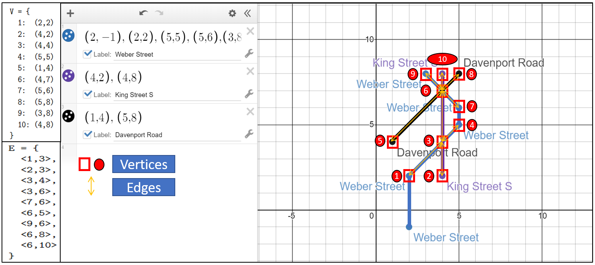

# Street Map Intersection Identifier

## Purpose
Calculates all intersection points, vertices and edges from a poly-line street map to produce an undirected graph.

## Definitions 
**Undirected Graph:** a set of objects (called vertices or nodes) that are connected together, where all the edges are bidirectional.

**Vertice:** There is a vertex corresponding to: (a) each intersection, and, (b) the end-point of a line segment of a street that intersects with another street.

**Edge:** There is an edge between two vertices if:  (a) at least one of them is an intersection, (b) both lie on the same street, and, (c) one is reachable from the other without traversing another vertex.

## Commands
To add a street to the system: 
```
a "enter street name" (0,0) (1,1) (2,2) ...
```
To change the coordinates of an existing street: 
```
c "enter street name" (0,0) (1,1) (2,2) ....
```
To remove a street from the system: 
```
r "enter street name"
```
To produce the undirected graph: 
```
g
```
## Example

**Input:**
```
a "Weber Street" (2,-1) (2,2) (5,5) (5,6) (3,8)
a "King Street S" (4,2) (4,8)
a "Davenport Road" (1,4) (5,8)
g
```
**Output:**
```
V = {
  1:  (2,2)
  2:  (4,2)
  3:  (4,4)
  4:  (5,5)
  5:  (1,4)
  6:  (4,7)
  7:  (5,6)
  8:  (5,8)
  9:  (3,8)
  10: (4,8)
}
  
E = {
  <1,3>,
  <2,3>,
  <3,4>,
  <3,6>,
  <7,6>,
  <6,5>,
  <9,6>,
  <6,8>,
  <6,10>
}
```
**Graphical Representation:**


**NOTE:** graphed using Desmos: https://www.desmos.com/calculator
